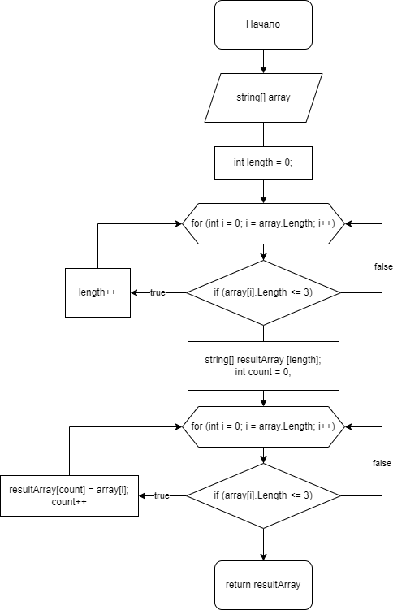

# Итоговая проверочная работа.

## Задача:
Написать программу, которая из имеющегося массива строк формирует массив из строк, длина которых меньше либо равна 3 символа. Первоначальный массив можно ввести с клавиатуры, либо задать на старте выполнения алгоритма. При решении не рекомендуется пользоваться коллекциями, лучше обойтись исключительно массивами.

### Алгоритм решения:
1. Обьявляем массив длинну которого опряделяет функция Random.
2. Метод FillArray  заполняет обьявленный массив символами от 1 до 9999.
3. Метод FilterFor3Char: 
- считает сколько элементов массива состоит из 3 и менее символов;
- обьявляет новый массив с длинной равной количеству элементов соответствующих требованию (<= 3);
- записывает элементы соответствующие требованию в новый массив;
- возвращает новый массив;
4. Выводим в консоль изначальный массив и измененный массив.

### Блок-схема:
